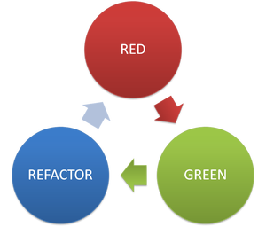

<h1 align="center">
    Starting TDD
</h1>
 

<h4 align="center">
  <strong>TDD in Node.js with Mocha & Chai</strong>
</h4>
 

  

 

  <a href="#floppy_disk-technology">Technology</a>&nbsp;&nbsp;&nbsp;|&nbsp;&nbsp;&nbsp;
  <a href="#computer-project">Project</a>&nbsp;&nbsp;&nbsp;|&nbsp;&nbsp;&nbsp;
  <a href="#nut_and_bolt-wrench-hammer-Developer">Contributors</a>&nbsp;&nbsp;&nbsp;|&nbsp;&nbsp;&nbsp;

 

For you, the developer, to write a success test, the important thing is that you follow the steps below:
 
1. Create a test
 
2. Run the test. At that point, the test should fail. If it doesn't fail, it's because either the test you created isn't testing correctly or your code has a bug
 
3. Then, develop a block of code needed to pass the test
 
4. Run the tests again and check if it will pass
 
5. Refactor
 
6. If necessary, repeat the process from the 1º item.

 

<h2 align="center">

</h2>
 

## :floppy_disk: Technology

This project was developed with the following technologies:

<ul>
  <li><a href="http://www.ecma-international.org/ecma-262/6.0/">Sintaxe ES6</a></li>
  <li><a href="https://nodejs.org/en/">Node.js</a></li>
  <li><a href="https://www.npmjs.com/">Npm</a></li>
  <li><a href="https://mochajs.org/">Mocha</a></li>
  <li><a href="https://www.chaijs.com/">Chai</a></li>
  <li><a href="https://code.visualstudio.com/">Visual Studio Code</a></li>
</ul>
 

## :computer: Project

Using TDD, test functions were developed to test a routine that calculates the value of a plot considering that:
 

5% interest is paid up to 30 days late;
 
10% interest is paid from 31 to 60 days late;
 
15% interest is paid after 60 days of delay;
 
 

 
 

#### 🔢 Commands

 

##### **`mocha -w`**
 

>
> It will be possible to view the exception of the tests in the Visual Studio Code terminal
>

 
 

## :nut_and_bolt: :wrench: :hammer: Developer
 

<table>
  <tr>
    <td align="center" style="border: none;">
      <a href="https://github.com/alinecbsr">
        
         
        
          <b>Aline Rosa</b>
        
      </a>
       
      
<scan title="Code">💻</scan>|<scan title="Documentation">🎨</scan>|<scan title="Bugs">🐛</scan>

    </td>
  </tr>
</table>
